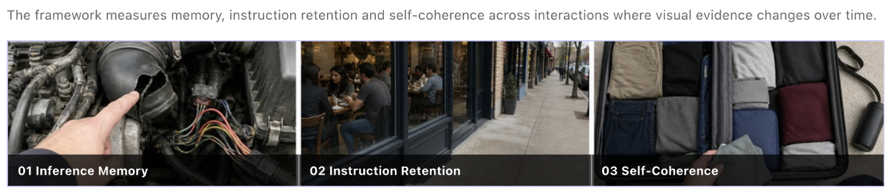

# Experience Bench

## TLDR

- **What is the project?** A proposal to build a multimodal interaction dataset and evaluation benchmark for continuous real-world conversations and agentic tasks.
- **Who is the proposal for?** Multimodal data labs and AI data labs that design, collect, validate, and package training and evaluation data.
- **Who is the target market?** Frontier AI labs and wearable or assistant platforms that would purchase the dataset and evaluation data to train and evaluate multimodal systems.
- **Why?** This data remains a gap. Current datasets do not bring continuous video, live conversation, long-horizon memory, evolving world state, and agentic actions together, while the proposal estimates a $58M base-case annual external data and evaluation opportunity.
- **What is different?** A live conversation and continuous video stream are evaluated together, then extended into agentic tasks such as saving a place, checking availability, or updating a list.

[Read the benchmark proposal](benchmark-proposal/Experience_Bench_Benchmark_Proposal.pdf) | [Watch the pilot video](tasks/trip_packing_video.mp4)

## Where the idea started

Wearable assistants experience the world as a stream. A camera stays on while the user speaks through a separate audio channel, points at objects, changes topics, returns to earlier places, and expects the assistant to remember what happened. A useful system has to connect an earlier comment to later visual evidence, retain instructions that were given once, and keep an accurate view of a world that continues to change.

At the time I developed this concept, I could not find an off-the-shelf dataset that combined all of the following in one evaluation-ready package:

- Continuous, first-person video from a wearable or mobile device
- Ambient audio and a separate stream of spoken user instructions
- Natural references such as "look at this" that only make sense when grounded in the video
- Multi-turn interactions that require memory across time
- App state and tool actions for tasks that continue beyond perception
- Human-reviewed rubrics that score the specific behavior each episode is designed to test

That gap makes it difficult for AI labs to measure the difference between a model that can describe a clip and one that can support a person through an ongoing experience.

## Who the proposal is for

This proposal is written for multimodal data labs and AI data labs. It gives them a product concept for designing, collecting, validating, and packaging a new multimodal dataset.

The target customers for that dataset are frontier multimodal labs and wearable or assistant platforms building spatial and ambient AI. Research leads, evaluation teams, data operations teams, and product teams at those organizations would use it to find important failures, produce targeted training data, and compare model versions with reproducible evidence.

## The pain points I prioritized

I prioritized the capabilities that sit closest to user trust and that also create distinct, measurable data requirements.

| Priority | Pain point | Why it matters | Benchmark response |
| --- | --- | --- | --- |
| 1 | The user speaks naturally and leaves references underspecified | A model can hear the words and still connect them to the wrong object or moment | Inference Memory |
| 2 | An instruction is given once and must remain active | Repetition creates friction, while a forgotten exclusion or threshold can produce the wrong outcome | Instruction Retention |
| 3 | Objects and plans change during the episode | Stale beliefs create contradictions and unreliable summaries | Self-Coherence |
| 4 | The assistant takes action in an app | A correct observation can still lead to poor timing, an incorrect app state, or an unwanted side effect | Experience Bench V2 |

The first three priorities form the V1 benchmark because they test whether the model can maintain a dependable understanding of the experience. The fourth becomes V2 because action quality depends on that understanding.

## How the product works

### Experience Bench V1

V1 evaluates the model while it observes a continuous video stream and listens to the user. The model is expected to retain relevant evidence and answer when asked. The benchmark focuses on three axes:

- **Inference Memory:** connect an earlier spoken cue with visual evidence, retain the inference, and use it later.
- **Instruction Retention:** keep applying a rule, including its exclusions and timing constraints, across a long episode.
- **Self-Coherence:** maintain one evolving world state as items move, disappear, return, or are replaced.

### Experience Bench V2

V2 adds an agent layer. The user can ask the model to do things such as save a place in Maps, check whether a restaurant has dinner availability, update a packing list, or create a comparison in Notes. Evaluation expands to action timing, tool execution, final app state, user intent, and unintended side effects.

## From discovery to pilot

I used a four-stage path so that the benchmark could move from a capability hypothesis to a repeatable data product.

1. **Proof of concept:** start with an existing audio-video episode and test whether the proposed axes reveal concrete model failures.
2. **Blueprint:** define the scenario, prompts, expected facts, exclusions, state transitions, and rubric criteria before grading.
3. **Record:** capture synchronized video, ambient audio, dialogue, and, for V2, app state and actions.
4. **Verify:** use criterion-level human review so that a single aggregate score can still be traced back to specific successes and failures.

The pilot uses a trip-packing video. It asks the model to remember outfits and reminders, then to reconcile where items ended up after the suitcase changed over time.

## Pilot evaluation

Each criterion receives a binary score. A response passes only when it fully satisfies the criterion. The aggregate score is the share of criteria passed.

| Task | Capability coverage | Result | What the result exposed |
| --- | --- | ---: | --- |
| Q1: describe outfits and reminders | Inference Memory, Instruction Retention | 0.60 | The response retained several high-level facts but missed accessories, confused the friend's item, and dropped two reminders. |
| Q2: describe final packing locations | Self-Coherence | 0.50 | The response tracked some final states but confused suitcase sides, edge locations, and the last placement of the blue jersey. |

These results are an early product signal from one video, two prompts, and one model run. They show that the rubric can isolate temporal failure modes. They do not support a general claim about model performance.

## Market and business case

The initial wedge is interaction data and evaluation for wearable assistants. The proposal starts from a $6.4B 2027 displayless smart-glasses market estimate, then applies an R&D share, a 15% combined data and evaluation allocation, and the share likely to be purchased from an external vendor.

| Scenario | R&D share | External vendor share | Estimated annual external data and evaluation spend |
| --- | ---: | ---: | ---: |
| Low | 10% | 30% | $29M |
| Base | 15% | 40% | $58M |
| High | 20% | 50% | $96M |

A common planning heuristic is that data can represent about 10% of a research or model-development budget. I use that as an initial buyer discussion point, rather than an industry constant. The proposal uses 15% for the combined data and evaluation layer because the scope includes collection, synchronization, gold labels, rubric design, and human review. Every percentage in the model is a planning assumption that should be tested through buyer interviews.

The ROI case should be measured against a customer's current workflow. The clearest value drivers are fewer duplicated collection efforts, less annotation rework, faster diagnosis of model failures, reusable evaluation episodes, and a shorter path from a discovered failure to targeted post-training data.

One useful pilot formula is:

`ROI = (evaluation engineering saved + annotation rework avoided + faster release value) / program cost`

## What I would measure next

- Coverage of each capability axis across tasks, environments, and interaction lengths
- Agreement between independent human graders
- Failure detection rate compared with short-clip evaluations
- Time and cost to turn a failed evaluation into a verified training example
- V2 task completion, action timing, final app-state accuracy, and side-effect rate
- Dataset reuse across model versions and customer teams

## Repository guide

The repository has three content folders. Every file appears once.

| Path | Contents |
| --- | --- |
| [`benchmark-proposal/`](benchmark-proposal/) | The Experience Bench proposal and its V1 evaluation-axis visual |
| [`tasks/`](tasks/) | Separate Q1 and Q2 folders for each prompt, model response, and grading output, plus the shared pilot video |
| [`rubrics/`](rubrics/) | Q1 and Q2 scoring criteria, plus the reusable judge prompt |

## Current scope

This repository is an early benchmark prototype. The pilot has one scenario, one source video, two questions, and one model response per question. Market sizing is directional. A production release would need broader scenarios, consent and privacy controls, independently validated rubrics, multiple models, repeated runs, and confidence intervals.
